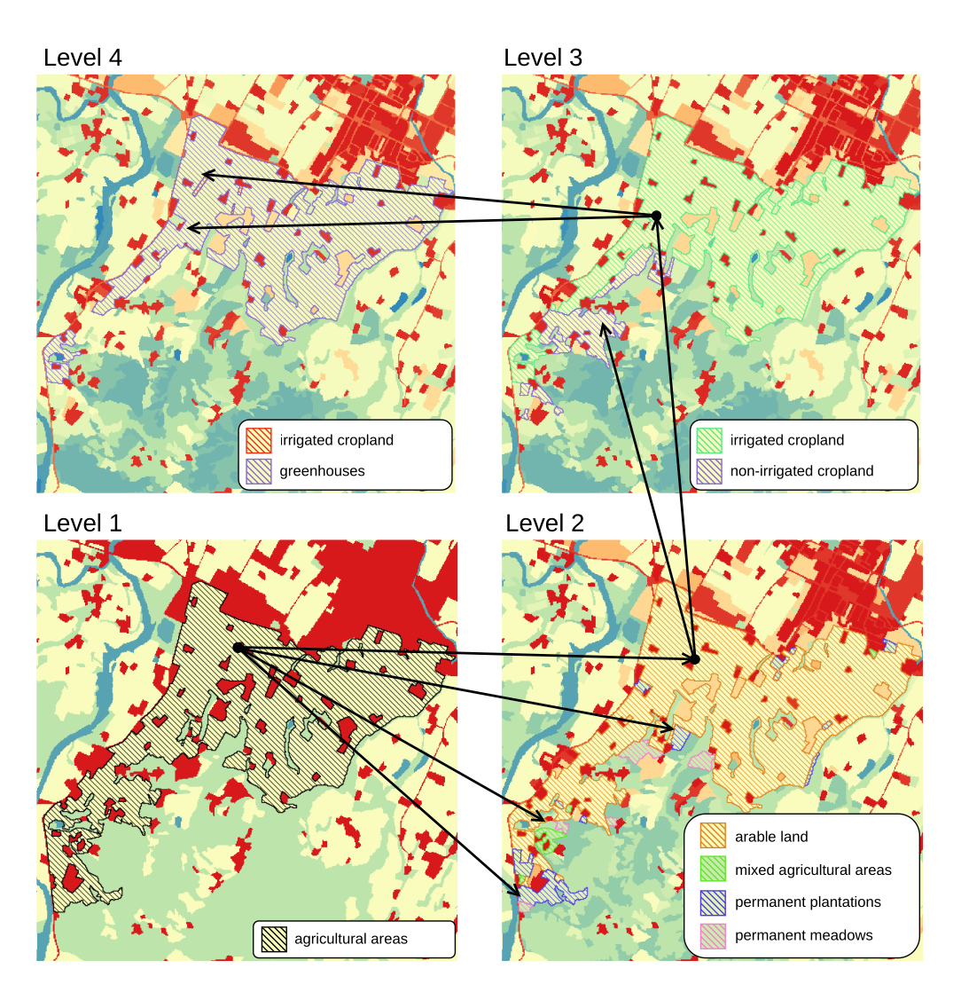
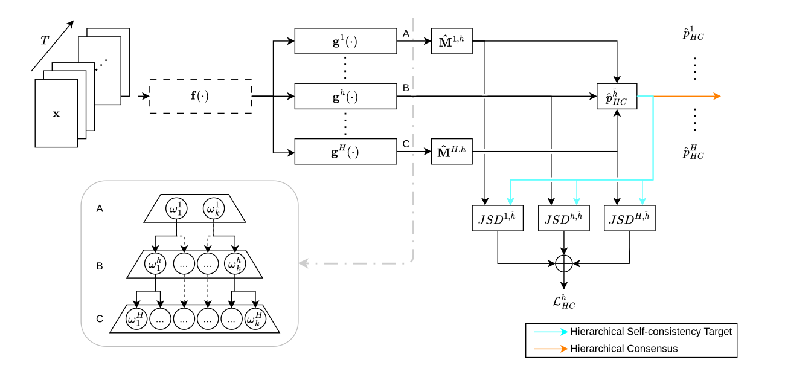
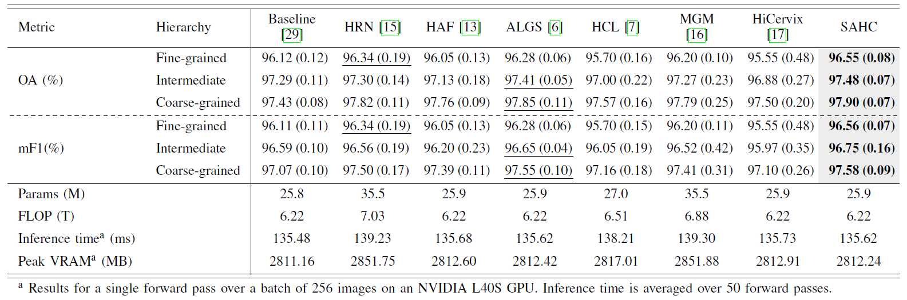
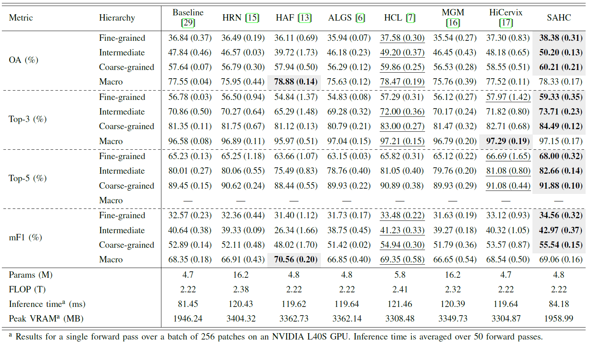

<div align="center">

<h1>Semantics-Aware Hierarchical Consensus Learning for Remote Sensing Image Classification</h1>

<div>
    <strong>This repository contains the official implementation of the paper "Semantics-Aware Hierarchical Consensus Learning for Remote Sensing Image Classification".</strong>
</div>

<div>
    Giulio Weikmann<sup>1</sup>&emsp;
    Gianmarco Perantoni<sup>1</sup>&emsp;
    Lorenzo Bruzzone<sup>1</sup>&emsp;
</div>
<div>
    <sup>1</sup>Remote Sensing Laboratory, Department of Information Engineering and Computer Science, University of Trento, Trento, Italy
</div>

<div>
    <h4 align="center">
    <a href="https://doi.org/10.1109/TGRS.2026.3731443" target='_blank'>[Journal]</a>
    • <a href="https://arxiv.org/abs/2510.04916" target='_blank'>[arXiv]</a>
    • <a href="https://github.com/rslab-unitrento/sahc" target='_blank'>[Project]</a>
    </h4>
</div>

<div align="center">

Hierarchical classification task example. Level 1 represents the coarsest class definition, where each class is progressively broken down into its fine-grained representations.
</div>

</div>

<ul style="list-style: none; padding-left: 0;">
    <div>
    • <strong>Hierarchical remote sensing classification</strong>: Land-cover and land-use classes naturally follow semantic taxonomies, yet standard deep-learning classifiers usually optimize each target level independently or consider only the finest-grained labels.
    </div>
    <div>
    • We propose <strong>Semantics-Aware Hierarchical Consensus (SAHC)</strong>, a modular framework that combines level-specific predictions through taxonomy-guided cross-level projections and a self-consistent hierarchical consensus.
    </div>
</ul>

# Key features

- **SAHC Framework**: a modular hierarchy-aware learning framework with level-specific classification heads, cross-level probability projectors, geometric consensus, and self-consistent training.
- **Taxonomy-Guided Adaptive Projectors**: projection matrices are initialized from the user-defined hierarchy and can be jointly optimized to calibrate cross-level compatibility while preserving the taxonomy as a semantic prior.
- **Multi-Task Remote Sensing Validation**: extensive experiments on VHR scene classification and multispectral Sentinel-2 satellite image time-series semantic segmentation, covering both simple and complex label hierarchies.


## Overview

SAHC introduces into a standard deep network backbone one classification head for each hierarchical level. For a target hierarchy level, the predictions produced at all other levels are projected into the target label space through cross-level probability projectors. The direct target-level prediction and the projected predictions are then fused through a normalized geometric mean to obtain a Hierarchical Consensus (HC) distribution.

During training, SAHC minimizes the standard supervised losses at all hierarchy levels together with a self-consistency loss that reduces the disagreement between each committee member and the HC. A supervised loss is also applied to the consensus prediction. The cross-level projectors can either be fixed from the user-defined taxonomy or initialized from the taxonomy and adaptively refined during optimization. At inference time, either the direct level-specific predictions or the hierarchy-aware consensus predictions can be used depending on the application.

<div align="center">

Fig. 1. Overview of the proposed SAHC architecture. Predictions generated by hierarchy-specific heads are reprojected to a common target level and geometrically fused to obtain the hierarchical consensus, which is used for self-consistent training and optional hierarchy-aware inference.
</div>
<br>

## Installation

We provide a devcontainer with GPU access and a system-site-packages PyTorch
environment. We manage the remaining project dependencies with uv.

```bash
git clone https://github.com/rslab-unitrento/sahc.git
cd sahc
```

## Data preparation

We use the following repository-relative layout:

```text
data/
├── elu/
│   ├── dataset.zarr
│   └── split_indices.pt
└── nwpu/
ELU.xlsx
ELU_original.xlsx
NWPU.xlsx
```

We prepare the ELU Zarr dataset with
`scripts/processing/config_files/zarr_converter.yaml`. We configure the
monthly composites, ground-truth raster, output Zarr path, and taxonomy
workbook there. We load NWPU through `VHRDataModule` using the existing
RESISC45 directory and split files.
- Data can be downloaded from [NWPU-RESISC45](https://www.kaggle.com/datasets/aqibrehmanpirzada/nwpuresisc45) and [ELU](https://geoportale.regione.emilia-romagna.it/catalogo/dati-cartografici/pianificazione-e-catasto/uso-del-suolo/layer-14).


## Datasets and hierarchy conventions

### NWPU-RESISC45

We use NWPU-RESISC45 for VHR RGB scene classification. The dataset contains
31,500 images organized into 45 fine, 24 intermediate, and 8 coarse classes.
We use the 0.6/0.2/0.2 train/validation/test split and the ResNet50 backbone.

### ELU

We use ELU for multitemporal Sentinel-2 semantic segmentation. The input
contains 12 monthly composites from 2020 at 10 m spatial resolution over MGRS
tile 32TPQ. We use an RSTT-based spatiotemporal backbone, 9×9 input patches,
and central 3×3 supervision. The complete taxonomy workbook contains 90, 40,
15, and 5 classes across four levels; after split-dependent class filtering,
the evaluated hierarchy contains 74, 33, 13, and 5 classes. We use the
0.7/0.15/0.15 train/validation/test tile split.

In our repository workbooks and YAML files, `Level_1` is the finest level and
larger level numbers are progressively coarser. The mathematical notation in
the article introduces hierarchy indices from coarsest to finest.

Each taxonomy is stored in a workbook sheet containing a `Code` column and one
or more `Level_*` columns. The loader derives ordered class labels, lookup
tensors, and mappings between levels from these columns. We preserve the
workbook ordering throughout data loading, training, and inference.


## Training

- The configuration files (hyperparameter settings) used in this work can be found under `scripts/config_files`
- The shared Lightning training entry point are run from the repository root:

```bash
  python scripts/tuning/lightning_tuning.py \
  --conf scripts/tuning/config_files/lightning_tuning_ELU_trainable.yaml
```

```bash
  python scripts/tuning/lightning_tuning.py \
  --conf scripts/tuning/config_files/lightning_tuning_ELU_fixed.yaml
```

```bash
  python scripts/tuning/lightning_tuning.py \
  --conf scripts/tuning/config_files/lightning_tuning_NWPU_trainable.yaml
```

Runs are written under `outputs/` paths and keep MLflow disabled
by default. 

## Inference

Use the inference script for the ELU Sentinel/Zarr geospatial
classification. The script writes a GeoTIFF. User has the possibility of selecting either `OG` or
`SAHC`.

```bash
  python scripts/tuning/inference.py \
  --conf scripts/tuning/config_files/inference.yaml
```

We evaluate NWPU
classification through the Lightning training/test workflow.

# Benchmark Hierarchical Experiments

We provide benchmark results for state-of-the-art methods on the NWPU and ELU datasets. All methods use the same task-specific backbone for a fair comparison.

<div align="center">

Table I. Test Performance Comparison of Different Methods on the NWPU-RESISC45 Dataset. The Best Average Metric Values Are Reported in Bold, Second Bests Are Underlined. The Related Standard Deviations Are Reported in Parenthesis.
</div>
<br>

<div align="center">

Table II. Test Performance Comparison of Different Methods on the ELU Dataset. The Best Average Metric Values Are Reported in Bold, Second Bests Are Underlined. The Related Standard Deviations Are Reported in Parenthesis.
</div>
<br>

# Citation
```BibTeX
@Article{weikmann_semantics_2026,
  author={Weikmann, Giulio and Perantoni, Gianmarco and Bruzzone, Lorenzo},
  journal={{IEEE Trans. Geosci. Remote Sens.}}, 
  title={{Semantics-Aware Hierarchical Consensus Learning for Remote Sensing Image Classification}}, 
  date={2026-09-07},
  volume={},
  number={},
  doi={10.1109/TGRS.2026.3731443},
  note={early access}
}
```

## Acknowledgments

This work was supported in part by European Space Agency (ESA) Climate Change Initiative Extension (CCI+) New Essential Climate Variables (ECVs) High Resolution Land Cover ECV (HRLC) under Contract `4000125259718/I-NB` and in part by Italian Space Agency (ASI) and the Ministry of University and Research (MUR) through the Project "SpaceItUp!" under Contract `2024-5-E.0`, CUP `I53D24000060005`.
